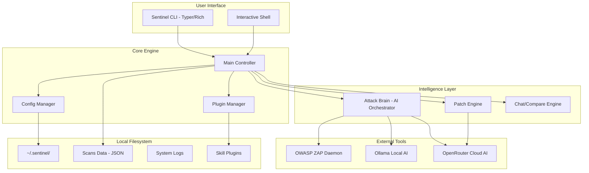
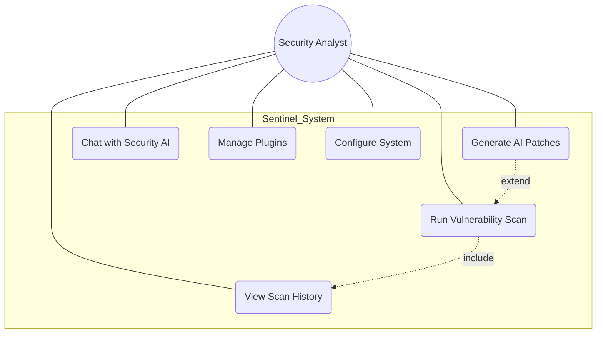
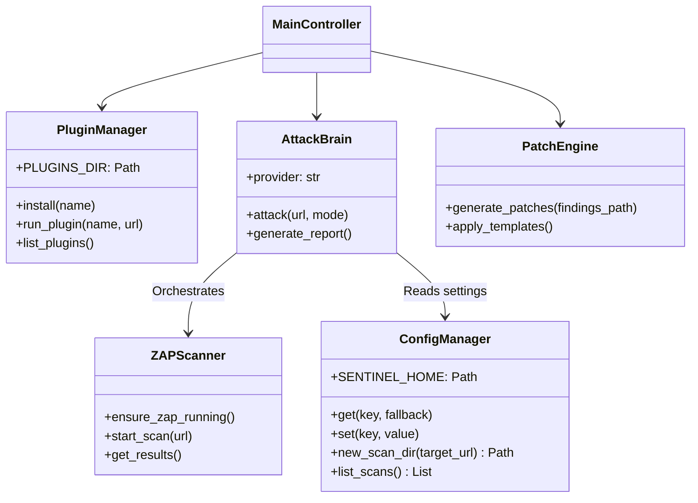
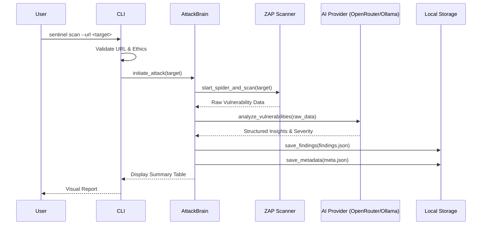
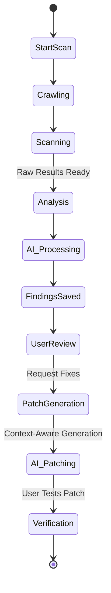
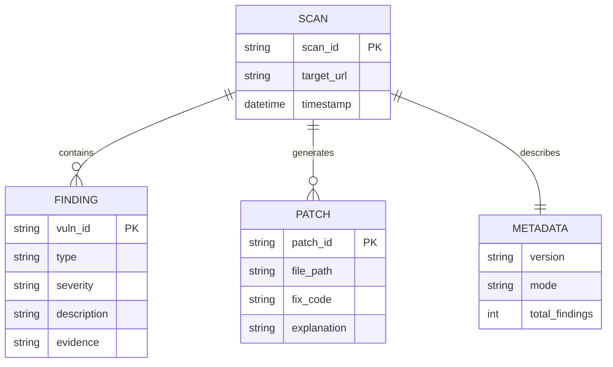

# Sentinel Project Design Documentation

This document contains the architectural and design specifications for **Sentinel**, an AI-powered security scanning and remediation platform.

---

## 4.1 Architecture Diagram

Sentinel follows a modular CLI-first architecture with AI orchestration. It integrates external security tools (ZAP) with cloud-based or local AI models to provide actionable security intelligence.

---

## 4.2 UML Diagrams

### Use Case Diagram

Describes the primary interactions between the Security Analyst and the Sentinel system.

### Class Diagram

Key components and their relationships within the Sentinel CLI.

### Sequence Diagram: Scan Execution Flow

Shows the logic flow when a user initiates a scan.

### Activity Diagram: Vulnerability Remediation Lifecycle

---

## 4.3 Database Design

Sentinel uses a **Document-Oriented Filesystem Storage** approach. Each scan is treated as a unique record (folder) containing JSON documents.

### ER Diagram (Logical)

### Table Structure (JSON Schema Representation)

#### 1. `meta.json` (Scan Header)
| Field | Type | Description |
| :--- | :--- | :--- |
| `target` | String | The URL of the scanned application. |
| `scanned_at` | DateTime | ISO timestamp of the scan start. |
| `mode` | String | Scan intensity (fast, deep, stealth). |
| `total_findings`| Integer | Count of identified vulnerabilities. |

#### 2. `findings.json` (Vulnerability Records)
| Field | Type | Description |
| :--- | :--- | :--- |
| `vuln_type` | String | Type of vulnerability (e.g., SQLi, XSS). |
| `severity` | String | Critical, High, Medium, Low, or Informational. |
| `url` | String | The specific endpoint where the flaw was found. |
| `evidence` | String | Raw HTTP request/response or snippet proving the flaw. |
| `remediation` | String | AI-suggested high-level fix. |

#### 3. `patches.json` (Fix Recommendations)
| Field | Type | Description |
| :--- | :--- | :--- |
| `file_context` | String | The source file or code block being patched. |
| `vulnerability` | String | Link to the finding being addressed. |
| `safe_code` | String | The secure version of the code. |
| `explanation` | String | Detailed reasoning for the security fix. |

---

### Data Dictionary

| Term | Definition |
| :--- | :--- |
| **SENTINEL_HOME** | The root directory for all persistent data (~/.sentinel). |
| **Scan ID** | A unique timestamped slug identifying a specific scan session. |
| **Brain** | The AI orchestration layer that handles prompt engineering and response parsing. |
| **Plugin** | A standalone security tool (e.g., Nuclei, Subfinder) integrated into the workflow. |
| **ZAP Daemon** | The background process running OWASP ZAP for dynamic analysis. |
