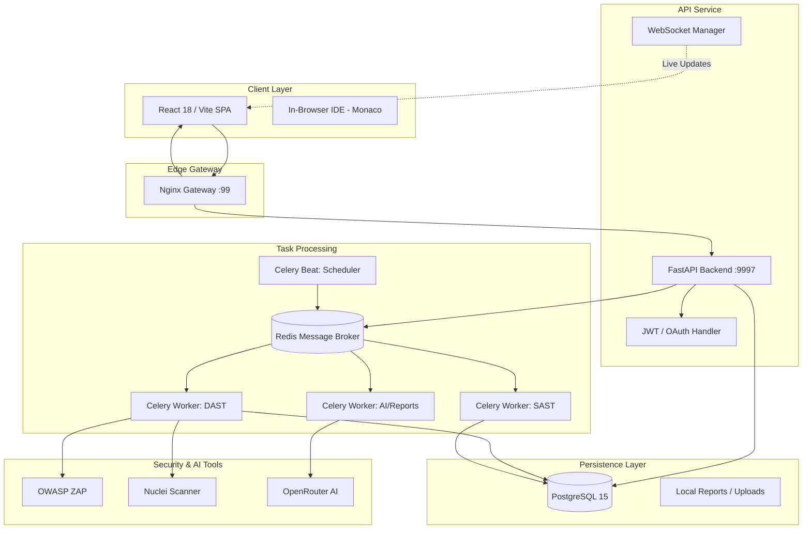
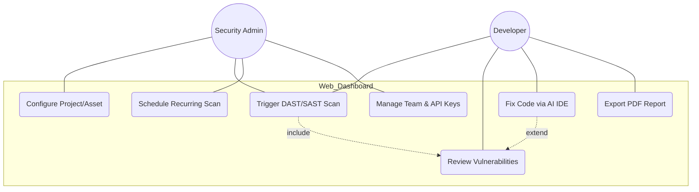
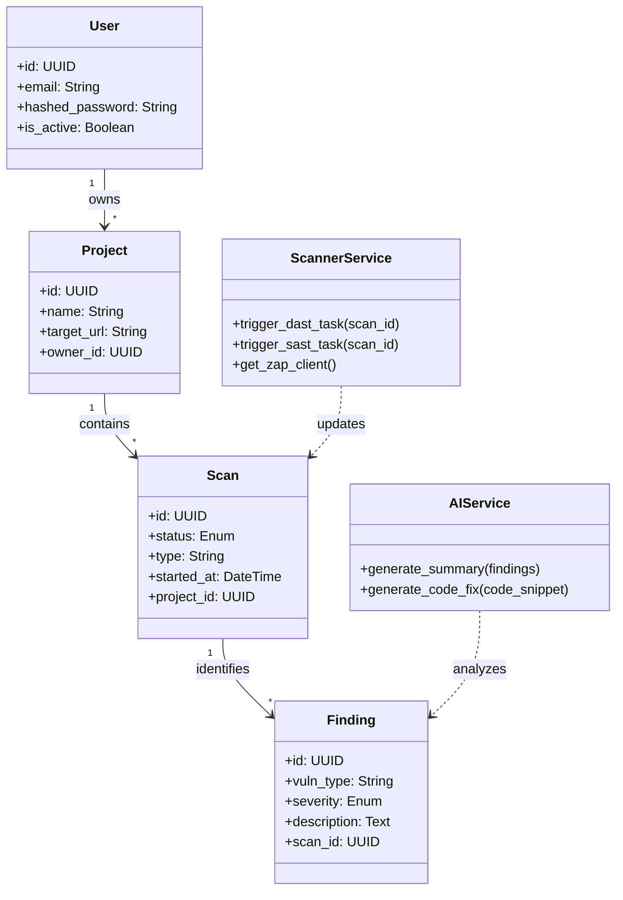
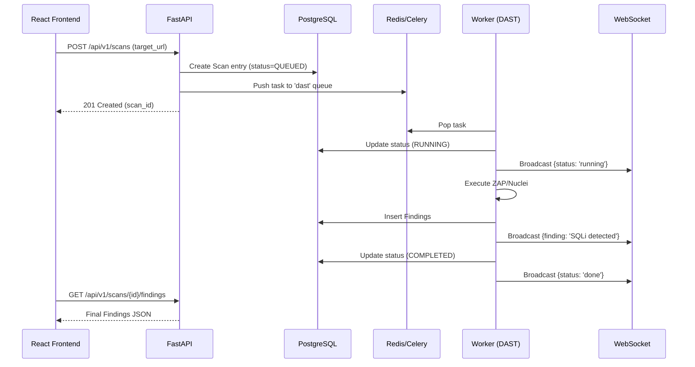
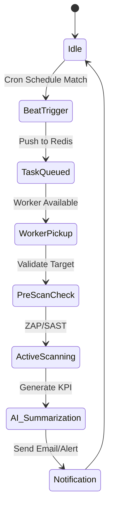
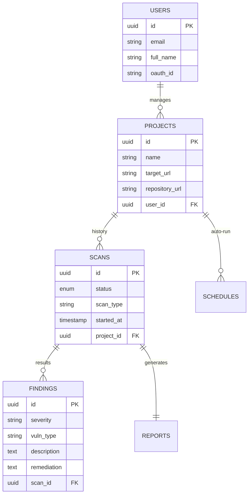

# ShieldSentinel Project Design Documentation

This document contains the architectural and design specifications for **ShieldSentinel**, the full-stack web dashboard component of the Sentinel Security Suite.

---

## 4.1 Architecture Diagram

ShieldSentinel uses a distributed microservices-inspired architecture managed by Docker Compose. It separates high-traffic API handling from long-running security scanning tasks.

---

## 4.2 UML Diagrams

### Use Case Diagram

Describes how different actors (Security Admin, Developer) interact with the web platform.

### Class Diagram (Backend Architecture)

Focuses on the FastAPI application structure and data models.

### Sequence Diagram: Web Scan Pipeline

Visualizes the lifecycle of a scan from request to UI update.

### Activity Diagram: Scheduled Scan Workflow

---

## 4.3 Database Design

ShieldSentinel uses a Relational Database (PostgreSQL) for structured data and Redis for ephemeral state/messaging.

### ER Diagram

### Table Structure (SQL Schema)

#### 1. `users`
| Column | Type | Constraints |
| :--- | :--- | :--- |
| `id` | UUID | PRIMARY KEY |
| `email` | String | UNIQUE, NOT NULL |
| `hashed_password` | String | NULL (if OAuth) |
| `created_at` | Timestamp | DEFAULT NOW() |

#### 2. `scans`
| Column | Type | Constraints |
| :--- | :--- | :--- |
| `id` | UUID | PRIMARY KEY |
| `project_id` | UUID | FOREIGN KEY -> projects.id |
| `status` | String | QUEUED, RUNNING, COMPLETED, FAILED |
| `risk_score` | Integer | 0 - 100 |

#### 3. `findings`
| Column | Type | Constraints |
| :--- | :--- | :--- |
| `id` | UUID | PRIMARY KEY |
| `scan_id` | UUID | FOREIGN KEY -> scans.id |
| `severity` | Enum | Critical, High, Medium, Low |
| `cve_id` | String | NULL |

---

### Data Dictionary

| Term | Definition |
| :--- | :--- |
| **Worker (Celery)** | A dedicated process for running resource-intensive scans without blocking the API. |
| **Beat** | The scheduler service that triggers tasks at specific intervals (Cron). |
| **Risk Score** | A calculated value based on the count and severity of findings in a scan. |
| **SAST** | Static Application Security Testing (Scanning source code/ZIP files). |
| **DAST** | Dynamic Application Security Testing (Scanning live running URLs). |
| **In-Browser IDE** | A Monaco-based code editor integrated with AI to fix vulnerabilities directly. |
