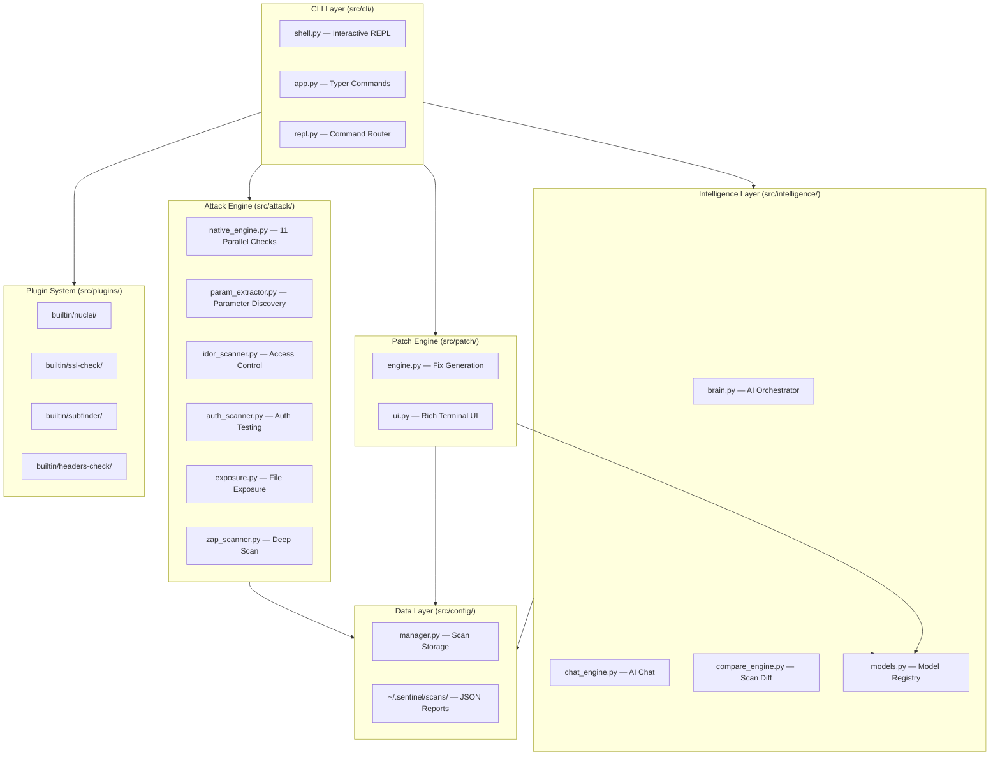
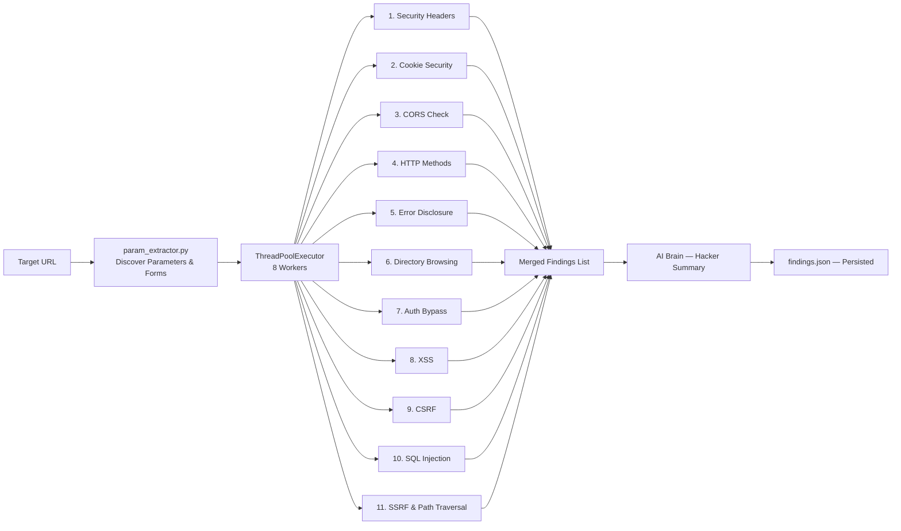
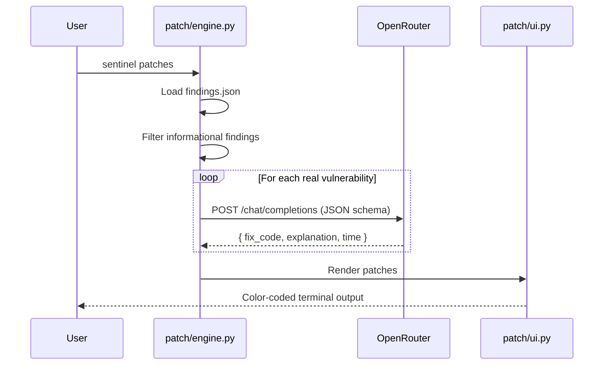
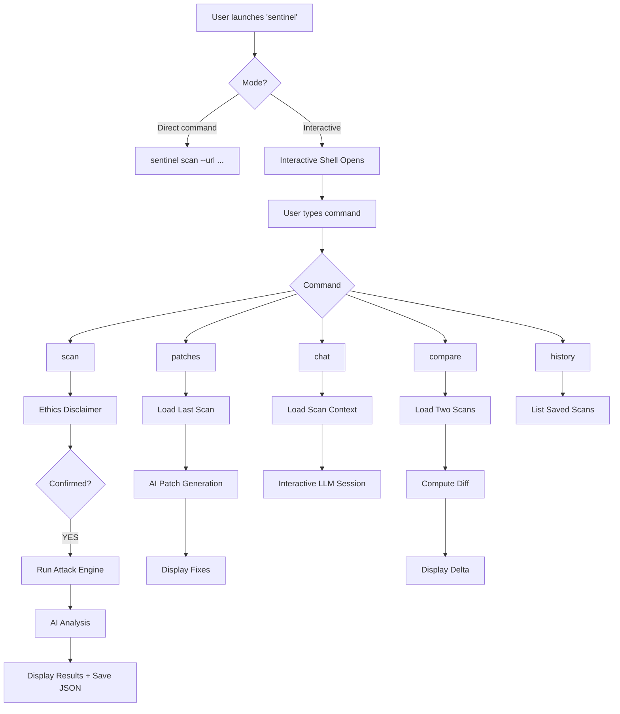
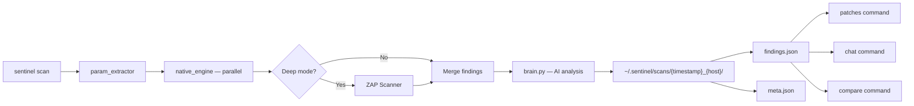
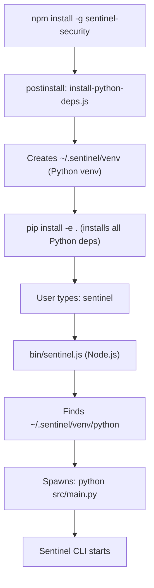
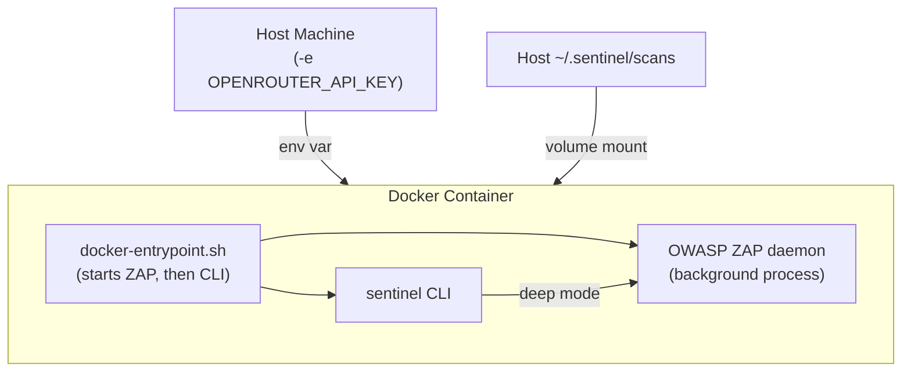

# Sentinel CLI — Technical Report
**Version:** 0.2.0 | **Author:** Sentinel Team | **Date:** April 2026  
**Classification:** Project Documentation

---

## Table of Contents

1. [Executive Summary](#1-executive-summary)
2. [Product Overview](#2-product-overview)
3. [System Architecture](#3-system-architecture)
4. [Attack Engine & Vulnerability Checks](#4-attack-engine--vulnerability-checks)
5. [AI Intelligence Layer](#5-ai-intelligence-layer)
6. [CLI & Interactive Shell](#6-cli--interactive-shell)
7. [Plugin Ecosystem](#7-plugin-ecosystem)
8. [Data Flow & Lifecycle](#8-data-flow--lifecycle)
9. [Distribution & Packaging](#9-distribution--packaging)
10. [Configuration & Environment](#10-configuration--environment)
11. [Technology Stack](#11-technology-stack)
12. [Security & Ethics](#12-security--ethics)
13. [Known Limitations & Future Work](#13-known-limitations--future-work)

---

## 1. Executive Summary

Sentinel CLI is a production-ready, AI-augmented command-line security scanner designed for ethical hackers, security engineers, and developers. It replaces traditional slow, GUI-dependent scanners with a blazing-fast terminal experience that delivers real vulnerability data in under 90 seconds.

The tool combines a pure-Python parallel attack engine with an OpenRouter-powered AI layer, enabling not just vulnerability detection but also automated patch generation and conversational security analysis. It is distributed globally as an NPM package (`sentinel-security`) and as a Docker image.

### Key Metrics

| Metric | Value |
|---|---|
| Scan completion time (fast mode) | ~60–90 seconds |
| Vulnerability categories tested | 11 (parallel) |
| AI providers supported | OpenRouter (100+ models) |
| Distribution channels | NPM, Docker |
| Supported platforms | Windows, macOS, Linux |
| License | MIT |

---

## 2. Product Overview

### 2.1 Core Capabilities

| Capability | Description |
|---|---|
| **DAST Scanning** | Tests live web applications for 11 vulnerability categories |
| **AI Patch Engine** | Generates copy-paste ready code fixes using LLMs |
| **AI Chat** | Conversational Q&A about scan findings with full context |
| **Scan Comparison** | Security diff between two scan reports |
| **Plugin System** | Extensible architecture with built-in Nuclei, SSL, Subfinder plugins |
| **Scan History** | Persistent JSON-based scan storage at `~/.sentinel/scans/` |
| **Interactive Shell** | REPL-style terminal with tab completion and command history |

### 2.2 Scan Modes

| Mode | Flag | Duration | Engine |
|---|---|---|---|
| **Fast** | `--mode fast` | 60–90 seconds | Native Python engine |
| **Deep** | `--mode deep` | Up to 10 minutes | Native + ZAP + Nikto |

---

## 3. System Architecture

### 3.1 Component Overview



### 3.2 Directory Structure

```
sentinel-cli/
├── src/
│   ├── attack/
│   │   ├── native_engine.py    # Core parallel scanner (11 checks)
│   │   ├── param_extractor.py  # JS bundle & form parameter mining
│   │   ├── idor_scanner.py     # IDOR & access control
│   │   ├── auth_scanner.py     # Authentication testing
│   │   ├── exposure.py         # Sensitive file exposure
│   │   ├── zap_scanner.py      # ZAP integration (deep mode)
│   │   └── nikto_scanner.py    # Nikto integration (deep mode)
│   ├── intelligence/
│   │   ├── brain.py            # Main AI engine & orchestrator
│   │   ├── models.py           # Central AI model registry
│   │   ├── chat_engine.py      # Interactive AI chat
│   │   └── compare_engine.py   # Scan comparison & diff
│   ├── patch/
│   │   ├── engine.py           # LLM-powered patch generation
│   │   └── ui.py               # Rich terminal patch display
│   ├── cli/
│   │   ├── shell.py            # Interactive REPL
│   │   ├── app.py              # Typer CLI definitions
│   │   └── repl.py             # Command routing
│   ├── plugins/
│   │   ├── manager.py          # Plugin discovery & execution
│   │   └── builtin/            # Built-in plugins
│   ├── config/
│   │   └── manager.py          # Config, scan storage, history
│   ├── utils/
│   │   ├── cleaner.py          # Output sanitization
│   │   └── replay.py           # Scan replay utilities
│   └── main.py                 # CLI entry point
├── Dockerfile
├── docker-compose.yml
├── docker-entrypoint.sh
├── package.json                # NPM distribution wrapper
├── bin/
│   ├── sentinel.js             # Node.js → Python bridge
│   └── install-python-deps.js  # Post-install venv setup
├── requirements.txt
├── setup.py
├── pyproject.toml
└── sentinel_cli.py             # Python entry stub
```

---

## 4. Attack Engine & Vulnerability Checks

### 4.1 Native Engine Design

The `SentinelNativeEngine` is a pure-Python attack engine built for speed and reliability. It uses Python's `concurrent.futures.ThreadPoolExecutor` with **8 worker threads** to run all 11 vulnerability checks in parallel, guaranteeing scan completion in under 90 seconds regardless of target response time.



### 4.2 Vulnerability Check Inventory

| # | Check | Severity | CWE | Method |
|---|---|---|---|---|
| 1 | **Security Headers** | Low–Medium | CWE-16 | Checks for X-Frame-Options, CSP, HSTS, X-Content-Type-Options, Referrer-Policy, Permissions-Policy |
| 2 | **Cookie Security** | Medium | CWE-614, CWE-1004 | Detects cookies missing `Secure` and `HttpOnly` flags |
| 3 | **CORS Misconfiguration** | Medium–High | CWE-942 | Injects `Origin: evil.com` and checks reflected response |
| 4 | **Insecure HTTP Methods** | Medium | CWE-749 | Sends OPTIONS request, checks for PUT/DELETE/TRACE/CONNECT |
| 5 | **Error Disclosure** | Medium | CWE-209 | Injects malformed payloads, matches Traceback/SQLSTATE patterns |
| 6 | **Directory Browsing** | Medium | CWE-548 | Probes `/assets/`, `/static/`, `/uploads/`, `/backup/` |
| 7 | **Authentication Bypass** | Critical | CWE-288 | Tests IP spoof headers against protected admin routes |
| 8 | **Cross-Site Scripting (XSS)** | High | CWE-79 | Injects `<script>alert()` into discovered GET parameters |
| 9 | **CSRF** | High | CWE-352 | Identifies POST forms without CSRF token fields |
| 10 | **SQL Injection** | Critical | CWE-89 | Injects quote payload, matches SQL error strings |
| 11 | **SSRF & Path Traversal** | Critical | CWE-918, CWE-22 | Tests URL params with AWS metadata URL and `../etc/passwd` |

### 4.3 Parameter Extraction

Before injection-based checks are run, `param_extractor.py` crawls the target to discover attack surface:

- **GET parameters**: Extracted from all linked URLs in the HTML response
- **Form inputs**: `<form>` elements parsed for POST parameters and action URLs
- **JavaScript bundles**: Parses inline `<script>` content for API route strings (useful for SPAs)

This ensures that XSS, SQLi, CSRF, and SSRF checks are only run when valid parameters exist, eliminating false negatives on modern single-page applications.

---

## 5. AI Intelligence Layer

### 5.1 AI Model Registry

All AI model identifiers are managed centrally in `src/intelligence/models.py`. This file acts as the single source of truth — changing a model here affects the entire application instantly.

```python
# src/intelligence/models.py

SUMMARY_MODEL = "nvidia/nemotron-nano-9b-v2:free"  # Hacker analysis
PATCH_MODEL   = "nvidia/nemotron-nano-9b-v2:free"  # Code fix generation
CHAT_MODEL    = "nvidia/nemotron-nano-9b-v2:free"  # Interactive chat
PRIMARY_MODEL = "nvidia/nemotron-nano-9b-v2:free"  # Fallback
```

All models are accessed via **OpenRouter**, which provides a unified OpenAI-compatible API for 100+ LLMs from providers including NVIDIA, Google, Meta, and Mistral.

### 5.2 AI Orchestrator (`brain.py`)

The `brain.py` module wraps all scan findings into a structured prompt and requests a "hacker-style" analysis from the LLM. The output includes:
- Which findings are most critical and why
- Realistic exploitation impact
- Prioritized remediation recommendations

### 5.3 Patch Engine (`patch/engine.py`)

For each valid vulnerability finding, the patch engine:
1. Constructs a detailed prompt including the vulnerability type, endpoint, parameter, and evidence
2. Sends to the LLM with a strict JSON schema response format
3. Parses the response to extract: `affected_code`, `fixed_code`, `explanation`, and `fix_time`
4. Filters out informational findings (no code to fix)

The output is rendered in a rich, color-coded terminal UI via `patch/ui.py`.



### 5.4 Chat Engine (`chat_engine.py`)

The chat engine enables a persistent, context-aware conversation about a scan's findings:

1. Loads the `findings.json` for the selected scan
2. Injects up to 20 vulnerability findings into the system prompt as context
3. Opens an interactive `prompt_toolkit` session with command history
4. Maintains a rolling conversation with the LLM

### 5.5 Compare Engine (`compare_engine.py`)

The compare engine provides a security diff between two scans:

- Identifies **fixed vulnerabilities** (in scan A but not in scan B)
- Identifies **new vulnerabilities** (in scan B but not in scan A)
- Calculates delta risk score
- Presents a structured, color-coded terminal summary

---

## 6. CLI & Interactive Shell

### 6.1 Command Reference

| Command | Description | Example |
|---|---|---|
| `scan` | Run a security scan against a URL | `sentinel scan --url https://example.com` |
| `scan --mode` | Choose scan depth | `sentinel scan --url https://example.com --mode deep` |
| `patches` | Generate AI patches for last scan | `sentinel patches` |
| `chat` | Start interactive AI chat | `sentinel chat` |
| `compare` | Diff two scans | `sentinel compare <id1> <id2>` |
| `history` | View past scans | `sentinel history` |
| `plugins` | List available plugins | `sentinel plugins` |
| `doctor` | System health check | `sentinel doctor` |
| `config show` | Display current settings | `sentinel config show` |
| `config set` | Update a setting | `sentinel config set scan_mode fast` |

### 6.2 Interactive Shell

The shell (`src/cli/shell.py`) is built using `prompt_toolkit`, providing:
- Persistent command history across sessions
- REPL-style input loop with `sentinel [model] ❯` prompt
- `cls` support for clearing the screen
- Graceful handling of `Ctrl+C` (continues loop) and `exit`/`quit` (exits cleanly)

### 6.3 User Flow



---

## 7. Plugin Ecosystem

### 7.1 Plugin Architecture

Sentinel supports a JSON-defined plugin format. Each plugin has:
- `plugin.json` — metadata (name, description, command, output format)
- `run.py` — Python execution logic

```
src/plugins/builtin/
├── headers-check/
│   ├── plugin.json
│   └── run.py
├── nuclei/
│   ├── plugin.json
│   └── run.py
├── ssl-check/
│   ├── plugin.json
│   └── run.py
└── subfinder/
    ├── plugin.json
    └── run.py
```

### 7.2 Built-in Plugins

| Plugin | Tool | Purpose |
|---|---|---|
| **headers-check** | Native Python | Security header validation with scoring |
| **ssl-check** | SSLyze | Certificate chain, TLS version, cipher auditing |
| **nuclei** | Nuclei binary | Template-based vulnerability scanning (3000+ templates) |
| **subfinder** | Subfinder binary | Passive subdomain enumeration |

---

## 8. Data Flow & Lifecycle

### 8.1 Scan Data Lifecycle



### 8.2 Findings JSON Schema

Each scan produces a `findings.json` with the following structure:

```json
{
  "target_url": "https://example.com",
  "scan_id": "2026-04-23_13-14-15_example.com",
  "timestamp": "2026-04-23T13:14:15Z",
  "scan_mode": "fast",
  "findings": [
    {
      "tool": "native_engine",
      "vuln_type": "Cross Site Scripting (Reflected)",
      "severity": "High",
      "endpoint": "https://example.com/search?q=...",
      "parameter": "q",
      "method": "GET",
      "evidence": "\"><script>alert('XSS')</script>",
      "description": "Unencoded payload reflected in response.",
      "solution": "Encode output using context-aware escaping.",
      "cweid": "79"
    }
  ],
  "hacker_analysis": "..."
}
```

### 8.3 Storage Layout

```
~/.sentinel/
├── config.json            # User settings
├── .chat_history          # Chat command history (prompt_toolkit)
└── scans/
    └── 2026-04-23_13-14-15_example.com/
        ├── findings.json  # Full scan report
        └── meta.json      # Scan metadata
```

---

## 9. Distribution & Packaging

### 9.1 NPM Package

Sentinel is distributed on the NPM registry as `sentinel-security`. Despite being a Python tool, NPM is used as the distribution channel via a JavaScript wrapper.

**How it works:**



**Key files:**

| File | Role |
|---|---|
| `package.json` | Package metadata, bin pointer, postinstall hook |
| `bin/sentinel.js` | Node.js wrapper that launches the Python process |
| `bin/install-python-deps.js` | Creates venv and runs `pip install` during `npm install` |

**Install command (user-facing):**
```bash
npm install -g sentinel-security
```

### 9.2 Docker Image

The Docker image bundles the entire security toolchain — no local dependencies required.

**What's included:**

| Component | Version |
|---|---|
| Ubuntu | 22.04 LTS |
| Python | 3.10 |
| Java (OpenJDK) | 11 |
| OWASP ZAP | 2.15.0 |
| Nuclei | 3.3.0 |
| Subfinder | 2.6.6 |
| Node.js | 20.x |

**Build command:**
```bash
docker build -t sentinel-security:latest .
```

**Run command:**
```bash
docker run -it -e OPENROUTER_API_KEY=sk-or-your-key sentinel-security
```

**Docker architecture:**



---

## 10. Configuration & Environment

### 10.1 Environment Variables

| Variable | Required | Description |
|---|---|---|
| `OPENROUTER_API_KEY` | ✅ Yes | API key for AI model access via OpenRouter |
| `GROQ_API_KEY` | ⚠️ Legacy | Retained for backwards compatibility |

### 10.2 Configuration File

Settings are stored at `~/.sentinel/config.json`:

```json
{
  "scan_mode": "fast",
  "openrouter_model": "nvidia/nemotron-nano-9b-v2:free",
  "timeout": 15,
  "max_params": 10
}
```

### 10.3 AI Model Registry

`src/intelligence/models.py` acts like a `.env` file but for AI models:

```python
SUMMARY_MODEL = "nvidia/nemotron-nano-9b-v2:free"
PATCH_MODEL   = "nvidia/nemotron-nano-9b-v2:free"
CHAT_MODEL    = "nvidia/nemotron-nano-9b-v2:free"
PRIMARY_MODEL = "nvidia/nemotron-nano-9b-v2:free"
```

To use a different model across the entire application, change the value here. No other files need updating.

---

## 11. Technology Stack

| Layer | Technology | Purpose |
|---|---|---|
| **Language** | Python 3.9+ | Core application |
| **CLI Framework** | Typer | Command definitions and routing |
| **Terminal UI** | Rich | Formatted output, panels, tables |
| **Interactive Shell** | prompt_toolkit | REPL with history and completion |
| **HTTP Client** | Requests | Target scanning |
| **HTML Parsing** | BeautifulSoup4 | Parameter and form extraction |
| **AI Client** | OpenAI SDK | OpenRouter API compatibility |
| **SSL Scanning** | SSLyze | TLS/certificate auditing |
| **ZAP Integration** | python-owasp-zap-v2.4 | Deep scan mode |
| **Network Scanning** | python-nmap | Port and service discovery |
| **Environment** | python-dotenv | `.env` file loading |
| **Concurrency** | concurrent.futures | Parallel attack execution |
| **Distribution (NPM)** | Node.js + cross-spawn | Cross-platform CLI wrapper |
| **Distribution (Docker)** | Ubuntu 22.04 | Containerized environment |
| **AI Provider** | OpenRouter | Access to 100+ LLMs |

---

## 12. Security & Ethics

### 12.1 Ethics Disclaimer

Every scan session begins with a mandatory ethics disclaimer that requires explicit user confirmation:

```
╭─ Ethics Disclaimer ─────────────────────────╮
│ Target: https://example.com                  │
│                                              │
│ ⚠ By proceeding you confirm:                 │
│   • You own this target, or                  │
│   • You have explicit written permission     │
│                                              │
│ Unauthorized scanning is illegal.            │
╰──────────────────────────────────────────────╯

Type YES to confirm and start scan:
```

The scan will not proceed without explicit `YES` confirmation.

### 12.2 API Key Security

- The `.env` file is listed in `.gitignore` and `.npmignore` to prevent accidental exposure
- API keys are loaded via `python-dotenv` and never hardcoded
- The NPM package excludes all `.env` files from the published tarball

### 12.3 Data Privacy

- All scan data is stored locally at `~/.sentinel/scans/`
- No telemetry, no data transmission to third-party servers (only OpenRouter API calls)
- Docker volume mounts are optional — default container data is ephemeral

---

## 13. Known Limitations & Future Work

### 13.1 Current Limitations

| Area | Limitation |
|---|---|
| **Authenticated Scanning** | No built-in session/cookie injection for scanning behind login walls |
| **ZAP Dependency** | Deep mode requires Java 11+ installed; not all users have it |
| **Parameter Discovery** | Relies on static HTML/JS parsing; dynamic SPAs may yield fewer params |
| **Rate Limiting** | Free AI models on OpenRouter have per-minute token limits |
| **Report Formats** | Only JSON output; no HTML or PDF report generation yet |
| **CI/CD Integration** | No native GitHub Actions or Jenkins plugin yet |

### 13.2 Roadmap

| Feature | Priority | Description |
|---|---|---|
| **HTML/PDF Reports** | High | Export scan results as printable reports |
| **Authenticated Scan Mode** | High | Supply session cookies or login credentials for auth-bypass testing |
| **GitHub Actions Plugin** | Medium | Auto-scan on every PR push |
| **Plugin Marketplace** | Medium | Community-contributed scanner plugins |
| **Docker Hub Publish** | Medium | One-command pull for any user globally |
| **Ollama Integration** | Low | Local LLM support for offline/air-gapped environments |
| **Multi-target Scanning** | Low | Scan multiple URLs from a file list |

---

## Appendix A — Installation Quick Reference

### NPM (Recommended)
```bash
npm install -g sentinel-security
export OPENROUTER_API_KEY="sk-or-your-key"
sentinel
```

### Docker
```bash
docker build -t sentinel-security:latest .
docker run -it -e OPENROUTER_API_KEY=sk-or-your-key sentinel-security
```

### From Source
```bash
git clone https://github.com/your-repo/sentinel-cli.git
cd sentinel-cli
pip install -e .
sentinel
```

---

## Appendix B — Vulnerability Severity Matrix

| Severity | CVSS Range | Action Required | Color |
|---|---|---|---|
| **Critical** | 9.0–10.0 | Immediate remediation | 🔴 Red |
| **High** | 7.0–8.9 | Fix within 24 hours | 🟠 Orange |
| **Medium** | 4.0–6.9 | Fix within 7 days | 🟡 Yellow |
| **Low** | 0.1–3.9 | Fix in next release | 🔵 Blue |
| **Informational** | 0.0 | Awareness only | ⚪ Grey |

---

*This document was generated as part of the Sentinel CLI v0.2.0 release. For the latest information, refer to the project README and installation guides.*
